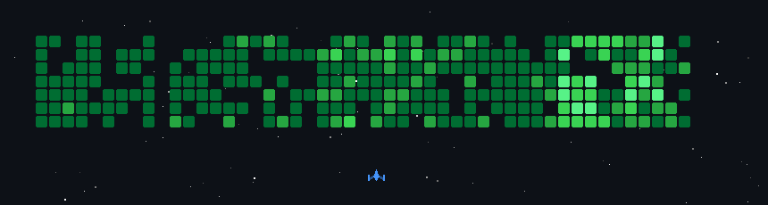

# Hey there, I'm Mark June! 👋 

### **Systems Architect • Database Engineer • Python Developer**

---

## 🧠 About Me

Systems Architect and Data Specialist engineering high-performance, scalable systems. With deep production experience across high-concurrency environments, I bridge the gap between complex business logic and robust, production-ready software.

- ⚡ **Core Focus:** High-Performance DB Systems (PostgreSQL), Async APIs (FastAPI), & Domain-Driven Design (DDD).
- 🏗️ **Infrastructure & AI:** Automated CI/CD pipelines, observability stack implementation, and structured data pipelines optimized for AI integrations.
- 🎙️ **Soft Skills:** Award-winning debater with an excellent command of English—excelling at cross-functional communication and technical translation for non-technical stakeholders.

---

## 🛠️ Tech Stack & Ecosystem

#### **Backend & Data Engineering**

#### **Tools, DevOps & Frontend**

---

## 🚀 Projects & Contributions

> 💡 **Explore my interactive portfolio & case studies:**  
> 👉 **[uppend.vercel.app](https://uppend.vercel.app)**

 

### 👾 Github Activity Matrix

---

## 📊 GitHub Analytics

